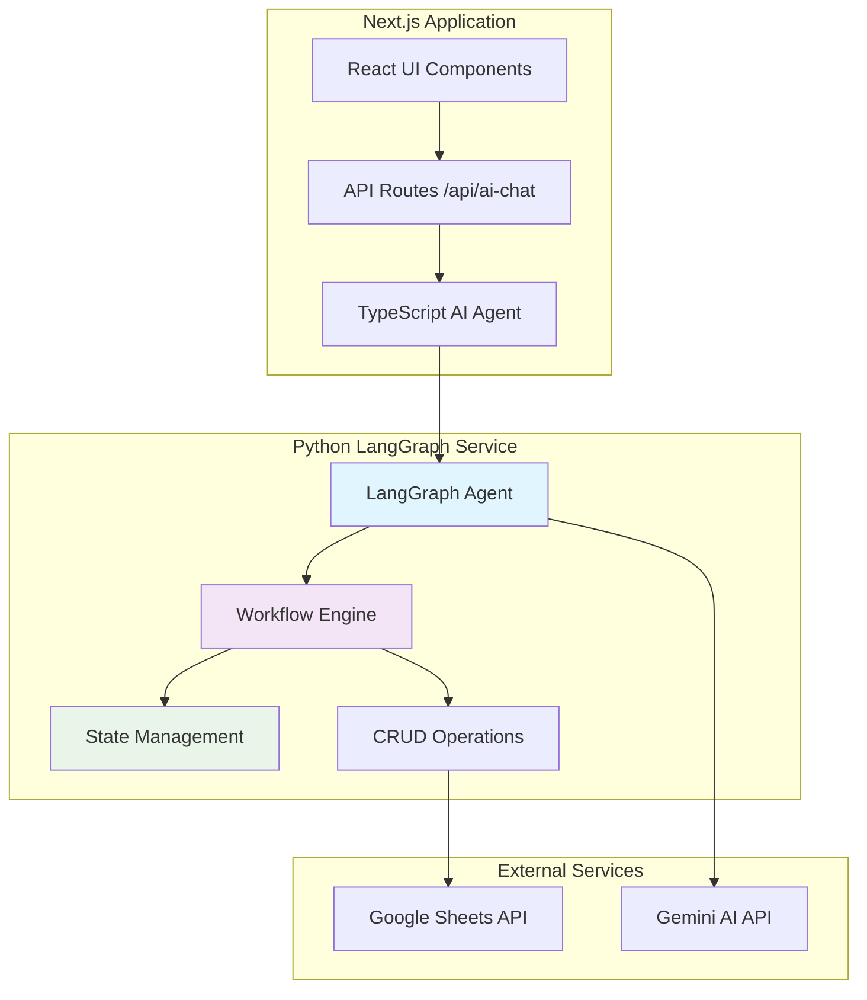
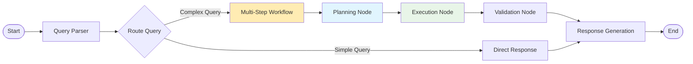

# Design Document

## Overview

This design outlines the implementation of a LangGraph-powered AI assistant that enhances the existing fundraising intelligence platform. The solution replaces the current simplified TypeScript agent with a sophisticated Python-based LangGraph agent capable of multi-step reasoning, conversation state management, and comprehensive CRUD operations on fundraising data.

The architecture maintains backward compatibility with the existing Next.js application while introducing advanced AI capabilities through a microservices approach. The Python LangGraph service will run as a separate containerized service, exposing REST APIs that integrate seamlessly with the current TypeScript interface.

## Architecture

### High-Level Architecture



### Service Communication Flow

1. **Request Flow**: User → Next.js UI → API Route → TypeScript Agent → Python LangGraph Service
2. **Response Flow**: Python Service → TypeScript Agent → API Route → UI
3. **Fallback Flow**: If Python service unavailable → TypeScript Agent handles request locally

### LangGraph Workflow Architecture



## Components and Interfaces

### 1. Python LangGraph Service

#### Core Components

**LangGraphAgent Class**
- Main orchestrator for AI workflows
- Manages conversation state and context
- Coordinates between different workflow nodes

**WorkflowEngine Class**
- Implements LangGraph workflow definitions
- Handles multi-step reasoning processes
- Manages node transitions and state updates

**StateManager Class**
- Maintains conversation context across interactions
- Stores intermediate results and user preferences
- Handles session management and cleanup

**CRUDOperations Class**
- Implements data manipulation operations
- Validates data integrity and business rules
- Provides audit logging for all changes

#### API Endpoints

```python
# Main chat endpoint
POST /api/v1/chat
{
    "message": "string",
    "chat_history": [ChatMessage],
    "session_id": "string"
}

# CRUD operations
POST /api/v1/data/{entity_type}
PUT /api/v1/data/{entity_type}/{id}
DELETE /api/v1/data/{entity_type}/{id}

# Health and status
GET /api/v1/health
GET /api/v1/status
```

### 2. TypeScript Integration Layer

**Enhanced AI Agent Interface**
```typescript
interface EnhancedAIAgent {
  processQuery(message: string, history: ChatMessage[]): Promise<string>;
  performCRUD(operation: CRUDOperation): Promise<CRUDResult>;
  getAnalytics(type: AnalyticsType): Promise<AnalyticsResult>;
  refreshContext(): Promise<void>;
}
```

**Fallback Mechanism**
```typescript
class HybridAIAgent {
  private async tryLangGraphService(request: AIRequest): Promise<AIResponse> {
    // Attempt Python service call with timeout
  }
  
  private async fallbackToTypeScript(request: AIRequest): Promise<AIResponse> {
    // Use existing TypeScript implementation
  }
}
```

### 3. Workflow Definitions

#### Multi-Step Analysis Workflow

```python
class AnalysisWorkflow:
    def create_workflow(self) -> StateGraph:
        workflow = StateGraph(AgentState)
        
        # Add nodes
        workflow.add_node("parse_query", self.parse_query_node)
        workflow.add_node("gather_data", self.gather_data_node)
        workflow.add_node("analyze_data", self.analyze_data_node)
        workflow.add_node("generate_insights", self.generate_insights_node)
        workflow.add_node("format_response", self.format_response_node)
        
        # Add edges
        workflow.add_edge(START, "parse_query")
        workflow.add_conditional_edges(
            "parse_query",
            self.should_gather_more_data,
            {
                "gather": "gather_data",
                "analyze": "analyze_data"
            }
        )
        
        return workflow.compile()
```

#### CRUD Operations Workflow

```python
class CRUDWorkflow:
    def create_workflow(self) -> StateGraph:
        workflow = StateGraph(CRUDState)
        
        workflow.add_node("validate_request", self.validate_request_node)
        workflow.add_node("check_permissions", self.check_permissions_node)
        workflow.add_node("execute_operation", self.execute_operation_node)
        workflow.add_node("audit_log", self.audit_log_node)
        workflow.add_node("confirm_result", self.confirm_result_node)
        
        return workflow.compile()
```

## Data Models

### Core State Models

```python
@dataclass
class AgentState:
    messages: List[ChatMessage]
    current_query: str
    session_id: str
    user_context: Dict[str, Any]
    data_context: DataContext
    analysis_results: List[AnalysisResult]
    needs_clarification: bool
    error_state: Optional[str]
    workflow_step: str

@dataclass
class CRUDState:
    operation_type: str  # CREATE, READ, UPDATE, DELETE
    entity_type: str     # funder, contribution, state_target, etc.
    entity_data: Dict[str, Any]
    validation_results: List[ValidationResult]
    permissions_checked: bool
    operation_result: Optional[Dict[str, Any]]
    audit_entry: Optional[AuditEntry]
```

### Enhanced Data Models

```python
class FunderModel(BaseModel):
    id: str
    name: str
    contact_info: ContactInfo
    contribution_history: List[str]  # contribution IDs
    preferences: Dict[str, Any]
    created_at: datetime
    updated_at: datetime

class ContributionModel(BaseModel):
    id: str
    funder_id: str
    state_code: str
    amount: Decimal
    fiscal_year: str
    date: datetime
    status: ContributionStatus
    metadata: Dict[str, Any]
```

### Integration Models

```typescript
// TypeScript interfaces for service communication
interface LangGraphRequest {
  message: string;
  chatHistory: ChatMessage[];
  sessionId: string;
  context?: Record<string, unknown>;
}

interface LangGraphResponse {
  success: boolean;
  message: ChatMessage;
  context: Record<string, unknown>;
  workflow_state?: string;
  error?: string;
}
```

## Error Handling

### Comprehensive Error Strategy

#### 1. Service-Level Error Handling

```python
class ErrorHandler:
    def handle_workflow_error(self, error: Exception, state: AgentState) -> AgentState:
        # Log error with context
        # Attempt recovery strategies
        # Update state with error information
        # Provide user-friendly error message
        
    def handle_data_access_error(self, error: Exception) -> Dict[str, Any]:
        # Implement retry logic with exponential backoff
        # Cache fallback data if available
        # Notify monitoring systems
```

#### 2. Integration Error Handling

```typescript
class ServiceErrorHandler {
  async handleLangGraphError(error: Error): Promise<AIResponse> {
    if (error.name === 'TimeoutError') {
      return this.fallbackToTypeScript();
    }
    if (error.name === 'ConnectionError') {
      return this.queueRequestForRetry();
    }
    // Handle other error types
  }
}
```

#### 3. Data Validation and Recovery

```python
class DataValidator:
    def validate_crud_operation(self, operation: CRUDOperation) -> ValidationResult:
        # Validate data integrity
        # Check business rules
        # Verify permissions
        # Return detailed validation results
        
    def recover_from_validation_error(self, error: ValidationError) -> RecoveryAction:
        # Suggest corrections
        # Provide alternative approaches
        # Guide user through resolution
```

## Testing Strategy

### 1. Unit Testing

**Python Service Tests**
```python
class TestLangGraphAgent:
    def test_query_processing_workflow(self):
        # Test individual workflow nodes
        # Verify state transitions
        # Check error handling
        
    def test_crud_operations(self):
        # Test data validation
        # Verify audit logging
        # Check permission enforcement
```

**TypeScript Integration Tests**
```typescript
describe('LangGraph Integration', () => {
  it('should handle successful responses', async () => {
    // Test successful service communication
  });
  
  it('should fallback gracefully on service failure', async () => {
    // Test fallback mechanism
  });
});
```

### 2. Integration Testing

**End-to-End Workflow Tests**
- Test complete user journeys through the AI assistant
- Verify data consistency across services
- Test error recovery scenarios

**API Contract Testing**
- Ensure API compatibility between services
- Test request/response formats
- Verify error response structures

### 3. Performance Testing

**Load Testing**
- Test concurrent user scenarios
- Measure response times under load
- Verify resource utilization

**Scalability Testing**
- Test horizontal scaling capabilities
- Verify stateless operation
- Test database connection pooling

## Security Considerations

### 1. Authentication and Authorization

```python
class SecurityManager:
    def authenticate_request(self, request: Request) -> AuthResult:
        # Verify JWT tokens
        # Check user permissions
        # Log access attempts
        
    def authorize_crud_operation(self, user: User, operation: CRUDOperation) -> bool:
        # Check role-based permissions
        # Verify data access rights
        # Enforce business rules
```

### 2. Data Protection

- **Encryption**: All data in transit and at rest
- **PII Handling**: Automatic detection and protection of sensitive data
- **Audit Logging**: Comprehensive logging of all operations
- **Data Sanitization**: Input validation and output sanitization

### 3. API Security

- **Rate Limiting**: Prevent abuse and ensure fair usage
- **Input Validation**: Comprehensive validation of all inputs
- **Error Handling**: Secure error messages without information leakage
- **CORS Configuration**: Proper cross-origin resource sharing setup

## Deployment Architecture

### 1. Containerization

```dockerfile
# Python LangGraph Service
FROM python:3.11-slim
WORKDIR /app
COPY requirements.txt .
RUN pip install -r requirements.txt
COPY . .
EXPOSE 8000
CMD ["uvicorn", "main:app", "--host", "0.0.0.0", "--port", "8000"]
```

### 2. Service Configuration

```yaml
# docker-compose.yml
version: '3.8'
services:
  langgraph-service:
    build: ./python-service
    environment:
      - GEMINI_API_KEY=${GEMINI_API_KEY}
      - GOOGLE_SHEETS_CREDENTIALS=${GOOGLE_SHEETS_CREDENTIALS}
      - DATABASE_URL=${DATABASE_URL}
    ports:
      - "8000:8000"
    healthcheck:
      test: ["CMD", "curl", "-f", "http://localhost:8000/health"]
      interval: 30s
      timeout: 10s
      retries: 3
```

### 3. Monitoring and Observability

```python
# Metrics and logging setup
import structlog
from prometheus_client import Counter, Histogram

# Metrics
REQUEST_COUNT = Counter('langgraph_requests_total', 'Total requests')
REQUEST_DURATION = Histogram('langgraph_request_duration_seconds', 'Request duration')

# Structured logging
logger = structlog.get_logger()
```

## Performance Optimization

### 1. Caching Strategy

```python
class CacheManager:
    def __init__(self):
        self.redis_client = redis.Redis()
        
    async def cache_analysis_result(self, query_hash: str, result: AnalysisResult):
        # Cache expensive analysis results
        
    async def get_cached_result(self, query_hash: str) -> Optional[AnalysisResult]:
        # Retrieve cached results for similar queries
```

### 2. Database Optimization

- **Connection Pooling**: Efficient database connection management
- **Query Optimization**: Optimized data retrieval patterns
- **Batch Operations**: Bulk operations for improved performance

### 3. Workflow Optimization

- **Parallel Processing**: Execute independent workflow nodes in parallel
- **Early Termination**: Stop processing when sufficient results are obtained
- **Resource Management**: Efficient memory and CPU usage